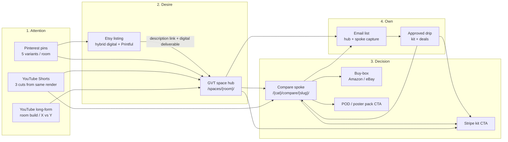

# Gear Versus Tech — Advertising / Distribution Funnel Pipeline

Canonical copy lives in `GVT-MASTER-PLAN.md` §L; this file is a standalone extract.

**Status:** Planning deliverable only (2026-07-16).  
**Scope:** YouTube · Pinterest · Etsy · GVT site. No code, no deploys, no secrets.  
**Aligns with:** `docs/GVT-MASTER-PLAN.md` (hub → spoke → buy-box; affiliate floor; Stripe/POD/email cash).  
**Approval channel:** HermesFusion_bot / Telegram. Estate anti-ban mode on.

---

## A. Funnel thesis

GVT does not win by “posting more gear content.” It wins by turning one room decision into a **owned path**: YouTube and Pinterest create *room desire* and park people on **space hubs**; spokes close the *which product* decision with buy boxes; Etsy harvests the people who already want the wall art / printable of that room; email turns every visitor into a second chance at a **Stripe kit** (primary cash) while Amazon/eBay remain free floor. Distribution is a fan-out of the same render + Remotion cut + DB hub update — never a Netlify deploy per post, never auto-publish, never fake engagement.

---

## B. Funnel map (Attention → Desire → Decision → Own)



**ASCII (if Mermaid not available):**

```
ATTENTION                    DESIRE                 DECISION                    OWN
─────────                    ──────                 ────────                    ───
YT long ──┐
YT Shorts ┼──► /spaces/{room}/ ──► /{cat}/compare/{slug}/ ──► Amazon/eBay
Pins ─────┘         │                    │                    Stripe kit
                    │                    └──► POD pack CTA     Email ──► drip ──► kit
                    └──► email capture
Etsy hybrid listing ──► digital download + link to same hub (not cold spam)
```

**Job of each surface (one line):**

| Surface | Stage | Job |
|---|---|---|
| YouTube long | Attention → Desire | Prove the room; send to hub |
| YouTube Shorts | Attention | Hook + one CTA to hub or one money spoke |
| Pinterest | Attention → Desire | Evergreen room porn → hub (primary) / Etsy (secondary) |
| Etsy | Desire → Own product | Sell POD/digital; soft-route browsers to GVT hub |
| GVT hub | Desire | Tiers + kit + email + spoke grid |
| GVT spoke | Decision | Winner + affiliate + kit/POD upsell |
| Email | Own | Highest-intent re-hit on kit + deals |

---

## C. Per-channel playbooks

### C1. YouTube

**Job in funnel:** Attention engine + trust. Long-form builds the room story; Shorts multiply the same footage. Primary destination = **space hub**. Secondary = one **money spoke** when the video is pure X vs Y.

**Organic formats + cadence**

| Format | Length | Cadence (start) | Source |
|---|---|---|---|
| Long-form room build / budget tiers | 8–14 min | 1 / week | Remotion + ComfyUI stills + B-roll |
| Long-form X vs Y (gaming/gym) | 6–10 min | 1 / fortnight (alt with room) | Same pipeline; product close-ups |
| Shorts | 20–45s | 3 / long-form (same week) | Cuts from long; one hook each |
| Community / pinned comment | — | On every upload | Hub URL + kit mention (no spam replies) |

**Assumption:** Channel can start at 1 long/week; do not scale Shorts volume until hooks are proven (watch % + CTR to site).

**CTAs and landing destinations**

| Video type | Primary CTA | Destination URL type |
|---|---|---|
| Room build (gaming / man cave / garage gym / pub shed) | “Full UK build tiers” | `/spaces/{room}/` |
| Budget tier deep-dive | “Get the kit” | Hub anchor `#kit` or Stripe product page (when live) |
| X vs Y | “Full comparison + UK prices” | `/{category}/compare/{slug}/` |
| Shorts | One line + end screen | Hub preferred; spoke only if title is product-specific |

**Never:** link only to Amazon in description (cookie dies; you train Amazon, not GVT). Affiliate lives on the spoke after they land.

**Listing / SEO title patterns**

```
{Room} on a UK Budget: £{low} vs £{mid} vs £{high} (2026)
{Product A} vs {Product B} UK — Which Should You Buy?
Garage Gym Under 2.4m Ceiling UK — Full Layout
{Room} Setup Ideas UK — Cable Plan + Desk Under 120cm
```

Description skeleton (no secrets):

1. One-sentence promise  
2. Timestamp chapters  
3. **GVT hub/spoke link** (UTM’d)  
4. Kit CTA if SKU live  
5. “UK prices / availability — check the page” (honesty > hype)  
6. Affiliate disclosure if any Amazon mention on-video  

Tags: room intent first (`garage gym uk`, `gaming room setup uk`), product second.

**Paid ads: when yes / when no**

| Yes (later) | No (now / never as default) |
|---|---|
| After 3+ videos with proven CTR to hub + kit live | Boosting unproven Shorts |
| Retarget site visitors / email engagers (small UK geo) | Broad “gaming setup” prospecting with no offer |
| Promote one kit landing once Stripe converts organically | Always-on YouTube ads before email + kit exist |

**Metrics that matter**

- End-screen / description CTR → GVT (not vanity views)  
- Hub sessions from `utm_source=youtube`  
- Email captures from YT-attributed sessions  
- Kit purchases attributed to YT (last non-direct + assisted)  
- Shorts: 3s hold + swipe-away; kill formats that don’t earn hub clicks  
- Ignore: subscriber count as a success metric in month 1

---

### C2. Pinterest

**Job in funnel:** Evergreen Attention → Desire. Pins are the cheapest long-tail room traffic for hubs. Secondary job: push gallery/POD intent toward Etsy **or** GVT POD CTA (one primary per pin set — don’t split every pin).

**Organic formats + cadence**

| Format | Spec (practical) | Cadence |
|---|---|---|
| Vertical idea pin (room hero) | 2:3, text overlay: room + UK budget | 5 pins / room render (fan-out) |
| Carousel / multi-image | Tier A / B / C stills | 1 per hub launch |
| Comparison pin | “A vs B — winner on GVT” | When spoke publishes |
| Seasonal refresh | Same asset, new title | Quarterly, not daily spam |

**Cadence start:** 5–10 pins/week across 1–2 rooms max. Quality boards > spray.  
**Assumption:** Business account; Idea Pins optional — static 2:3 stills from ComfyUI are enough to start.

**CTAs and landing destinations**

| Pin intent | Destination |
|---|---|
| Room inspiration / tiers | `/spaces/{room}/` (**default**) |
| Product decision | `/{category}/compare/{slug}/` |
| Wall art / printable | Etsy hybrid listing **or** GVT POD product URL — pick one primary per campaign |
| Kit | Hub `#kit` / Stripe URL only when SKU live |

**Listing / SEO title patterns**

```
UK {Room} Ideas — {Budget} Setup Layout
{Room} Moodboard: Desk, Lighting, Cable Plan (UK)
Garage Gym Layout for Small UK Garages
Man Cave Bar Shed — Lighting + Power Checklist
{Product A} vs {Product B} — UK Buy Guide
```

Pin description: 2–3 sentences, keywords natural, single URL, disclosure if affiliate page.

Board taxonomy (keep lean):

- Gaming Room UK  
- Garage Gym UK  
- Man Cave / Pub Shed  
- UK Gear Comparisons  
- Printable Room Art (POD)

**Paid ads: when yes / when no**

| Yes | No |
|---|---|
| After organic pin → hub CTR proven; kit or POD live | Cold traffic ads to empty kit CTAs |
| Small UK/IE geo tests on best-performing pin creative | Broad interest blasting daily |
| Retarget GVT visitors | Buying traffic to Amazon outbound |

**Metrics that matter**

- Outbound clicks → GVT (and Etsy if used)  
- Saves (quality signal for distribution)  
- Hub / spoke sessions `utm_source=pinterest`  
- Email + kit from Pinterest sessions  
- Cost per email / cost per kit **only after** paid starts  
- Ignore: impressions without outbound clicks

---

### C3. Etsy

**Job in funnel:** Desire → Own **product** (POD + digital). Not a traffic replacement for SEO. Etsy buyers who want the poster of the room they saw on Pinterest/YT; listing copy routes browsers to the matching **GVT hub** for the full build (soft, policy-safe — no bait-and-switch).

**Organic formats + cadence**

| Listing type | Contents | Cadence |
|---|---|---|
| Hybrid digital + physical | Printable download + Printful physical upgrade | 1 listing per room pack to start |
| Personalised (“X’s Game Room”) | Name field + mockups | 1–2 variants after first pack sells |
| Pack of 3 gallery | Same visual system as GVT POD | Launch with hub, not before IP is clean |

**Cadence:** 1 solid listing / fortnight until 4 room packs exist. Photos > volume.  
**Hard no:** licensed game art, team logos, celebrity likeness (master plan).

**CTAs and landing destinations**

| Surface | CTA |
|---|---|
| Listing photos | Mockup on real wall + “digital instant / physical ships” |
| Description | “Building the full room? UK tiers + shopping list →” **hub URL** (UTM’d) |
| Digital thank-you / download PDF cover | Same hub + kit offer |
| GVT site | Reciprocal: POD block can mention “also on Etsy” (**assumption:** only if brand wants marketplace SEO; not required) |

Do **not** stuff Etsy with affiliate link farms. One hub link in description is enough.

**Listing / SEO title patterns** (Etsy ~140 char; front-load)

```
Gaming Room Poster Printable | UK Setup Blueprint Wall Art | Digital Download
Garage Gym Wall Art Set of 3 | Home Gym Printable Posters | Instant Download
Personalised Game Room Print | Custom Name Gaming Poster | Digital + Print
Man Cave Bar Shed Sign Printable | Pub Shed Wall Art UK
```

Tags: room + printable + poster + digital download + UK spelling variants sparingly.  
Attributes: digital download + physical when hybrid.

**Paid ads: when yes / when no**

| Yes | No |
|---|---|
| Etsy Ads **after** organic listing has views + ≥1 sale or strong favorites | Day-1 max bid on untested creative |
| Offsite ads only with proven SKU + margin math | Running Etsy Ads to “build brand” with no GVT email capture plan |

**Metrics that matter**

- Listing views → favorites → orders  
- Digital vs physical mix (margin)  
- Refund / IP strike zero  
- Visits to GVT from Etsy UTMs (secondary)  
- Net profit after Printful + Etsy fees (not gross sales)

---

## D. Single-asset fan-out recipe

**One room render (ComfyUI/RTX) → full weekly packet.** No Netlify deploy. Hub copy update = Supabase (or CMS row) only.

### Inputs (once)

1. **Hero room still** (master) + 2 angle variants + 1 detail crop  
2. **Budget tier labels** (£low / £mid / £high) burned or overlaid in Remotion  
3. **Spoke targets** — 1–2 live compare URLs for products visible in the room  
4. **Kit SKU status** — live or omit kit CTA  
5. **Etsy/POD pack** — same art, print-safe export (300dpi / Printful template)

### Outputs (same week)

| # | Asset | Notes |
|---|---|---|
| 1 | **Long YouTube** | Remotion assembly: hook → 3 tiers → 2 product callouts → CTA to hub |
| 3 | **Shorts** | (1) hero reveal, (2) £budget shock, (3) one product “don’t buy X buy Y” |
| 5 | **Pins** | 3 room variants + 1 tier comparison graphic + 1 spoke “A vs B” |
| 1 | **Etsy hybrid listing** | Pack-of-3 or personalised using same IP; hub link in description |
| 1 | **GVT hub update** | New hero still, tier blurb, spoke links, email + kit CTAs — **DB only** |

### Production order (minimize thrash)

```
ComfyUI master stills
  → print-safe crop (POD/Etsy)
  → Remotion long
  → export 3 Shorts
  → export 5 pin stills (overlays)
  → draft YT titles/descriptions + pin copy + Etsy listing (local drafts)
  → Telegram approve packet
  → publish YT → Pins → Etsy (stagger same day or +24h)
  → flip/update hub row in Supabase (no deploy)
  → IndexNow/GSC hygiene if new spoke URLs published same week (optional)
```

**Do not:** trigger Netlify build for the hub image/copy update.

---

## E. UTM + conversion taxonomy

### UTM convention

```
utm_source   = youtube | pinterest | etsy | email | direct
utm_medium   = video | social | referral | email | cpc
utm_campaign = {room}_{yyyymm}           e.g. gaming-room_202607
utm_content  = {asset_id}                e.g. long01 | short02 | pin03 | listing
utm_term     = optional keyword          e.g. under-1500 | wooting-vs-razer
```

**Examples**

```
https://gearversustech.com/spaces/gaming-room/?utm_source=youtube&utm_medium=video&utm_campaign=gaming-room_202607&utm_content=long01

https://gearversustech.com/gaming/compare/wooting-60he-vs-razer-huntsman-v3-pro/?utm_source=youtube&utm_medium=video&utm_campaign=gaming-room_202607&utm_content=short03

https://gearversustech.com/spaces/garage-gym/?utm_source=pinterest&utm_medium=social&utm_campaign=garage-gym_202607&utm_content=pin02

https://gearversustech.com/spaces/gaming-room/?utm_source=etsy&utm_medium=referral&utm_campaign=gaming-room_202607&utm_content=listing
```

**Assumption:** Hub paths `/spaces/*` are proposed IA (master plan) — confirm before hardcoding in templates; until hubs exist, land on best live category hub/home with same UTM grammar.

### Conversion events (track / define)

| Event | Definition | Primary owner |
|---|---|---|
| `session_hub` | Land on space hub | Desire |
| `session_spoke` | Land on compare | Decision |
| `click_affiliate` | Buy-box Amazon/eBay (`gvt_clicks` or equiv.) | Floor revenue |
| `email_capture` | ESP subscribe from hub/spoke | Own |
| `kit_checkout_start` | Stripe Checkout opened | Cash |
| `kit_purchase` | Stripe paid | Cash |
| `pod_purchase_site` | Printful/Stripe POD on GVT | Cash |
| `pod_purchase_etsy` | Etsy order (export/CSV later) | Cash |
| `assisted_kit` | Email drip → kit within 7d | Own |

**Reporting grain (weekly):** by `utm_source` × `utm_campaign` → sessions → email → kit → affiliate clicks.  
**Do not optimize for:** affiliate clicks alone (24h cookie; delayed payout).

### Disclosure

UK-facing: clear affiliate disclosure on spokes + any YT description that mentions products. Etsy: handmade/digital attributes truthful.

---

## F. Approval / anti-ban gates

### Allowed without Telegram approval

- Local ComfyUI / Remotion / pin image generation  
- Draft titles, descriptions, Etsy listing copy (unpublished)  
- Hub/spoke **draft** rows (`published=false`)  
- This plan and redacted metrics notes  
- Affiliate link QA / Amazon sync dry-runs (no secret dump in chat)

### Requires HermesFusion_bot / Telegram approval

| Action | Why |
|---|---|
| YouTube publish (long or Shorts) | Social publish |
| Pinterest publish / scheduling live | Social publish |
| Etsy listing go-live or major update | Marketplace publish |
| Email campaign / drip send | Unsolicited risk if cold; always gated |
| Paid ads (YT / Pinterest / Etsy Ads) | Paid spend |
| Prod Netlify deploy | Credit + production |
| Credentials / API keys for platforms | Secrets |

### Hard prohibited (estate anti-ban)

- Fake views, bots, purchased engagement, engagement pods  
- Auto-comment spam, mass DMs, unsolicited bulk email  
- CAPTCHA bypass, proxy/identity rotation to evade limits  
- Scraping/automation that violates platform ToS / robots  
- Cloaking different content to ads vs users  
- Licensed IP on POD/Etsy  
- Auto-deploy on content publish  
- Auto-publish LLM articles on a timer  

### Publish packet checklist (attach to every Telegram ask)

1. Asset list (files + destinations)  
2. Final URLs with UTMs  
3. Disclosures present  
4. Hub/spoke live and buy-box not empty (for any spoke linked)  
5. Kit CTA only if Stripe live — else omit  
6. IP original confirmation for POD/Etsy  
7. No Netlify deploy requested unless code changed  

---

## G. 30-day distribution sprint checklist

**Goal:** Prove the loop **render → YT/Pins → hub → email/kit (or affiliate floor)** on **one room**, not presence on every platform.

**Assumptions:** Engine buy-box + at least one money spoke healthy before heavy traffic; Stripe kit #1 ideally live by week 3; hubs may start as “best available landing” if `/spaces/*` not coded yet.

### Week 0 — Prep (days 1–3)

- [ ] Pick **one** room for the sprint (recommend: **gaming-room** or **garage-gym** — kit narrative clearest)  
- [ ] Confirm landing URL (hub if live, else temporary spoke cluster / home section)  
- [ ] Confirm 2 spoke URLs with non-empty buy boxes  
- [ ] UTM spreadsheet tab: campaign name `{room}_{yyyymm}`  
- [ ] ESP capture working on landing (or explicitly defer email metrics)  
- [ ] Printful template + Etsy draft listing ready (unpublished)  
- [ ] Remotion + ComfyUI pipeline smoke: one still → 15s test cut  

### Week 1 — First packet

- [ ] Produce master stills (hero + 2 angles + detail)  
- [ ] Remotion long #1 drafted  
- [ ] 3 Shorts cut  
- [ ] 5 pins exported  
- [ ] Hub row/content updated in DB (draft → ready)  
- [ ] Telegram approve → publish YT long + 3 Shorts + 5 pins (stagger OK)  
- [ ] Etsy listing: approve → publish **or** hold if IP/mockups weak  
- [ ] Verify UTMs hit Analytics/plausible/whatever is wired (no secrets in docs)  

### Week 2 — Double down / kill losers

- [ ] Read metrics: YT CTR to site, pin outbound, hub bounce, email  
- [ ] Kill Shorts hooks with no site clicks; remix 2 new Shorts from same long  
- [ ] Refresh 3 pin titles (same creative) for best saver  
- [ ] Publish **one** X vs Y long **or** second room only if week 1 CTR > noise floor  
- [ ] Spoke footnote: “As seen on YouTube” optional — content only, no deploy  

### Week 3 — Cash layer

- [ ] Stripe kit CTA live on hub (if not earlier)  
- [ ] YT pinned comment + description updated to kit (approval)  
- [ ] Email welcome / kit offer **drafted**; first send only after Telegram approve  
- [ ] Etsy: first A/B mockup swap if zero favorites  
- [ ] Log affiliate clicks from campaign UTMs (floor check, not KPI north star)  

### Week 4 — Retro + freeze

- [ ] One-page retro: what earned hub sessions / email / kit  
- [ ] Freeze underperforming channel for next 30d (don’t “be everywhere”)  
- [ ] Lock fan-out recipe as SOP for room #2  
- [ ] Queue next room packet drafts only — **no** auto-schedule firehose  
- [ ] Confirm **zero** content-triggered Netlify deploys this month  
- [ ] Confirm **zero** unapproved social/marketplace publishes  

### Done = (distribution)

Not “posted daily.” Done means: **≥1 full fan-out packet shipped under approval**, UTMs readable, landing buy-box/kit honest, and a written keep/kill on YT vs Pins vs Etsy for the next sprint.

---

## Appendix — assumptions (distribution)

1. `/spaces/{room}/` hubs ship as in master plan; until then, land traffic on the best live equivalent and keep UTM grammar stable.  
2. Analytics stack exists or will exist (GA4 / Plausible / etc.) — implementation not in this doc.  
3. Etsy is distribution for POD, not required before Stripe-on-site POD.  
4. YouTube monetization is irrelevant in month 1; site conversion is the scoreboard.  
5. Pinterest lag: expect meaningful organic traffic weeks–months; judge early on outbound CTR + saves.  
6. Remotion templates are estate-local; no paid stock required for v1.  
7. All paid spend stays opt-in after organic proof — default **no ads** in first 30 days.  
8. No per-article or per-pin Netlify deploys; content from DB.  

---

*End of Advertising / Distribution Funnel Pipeline. Implementation / publishing only on explicit command + Telegram approval.*
