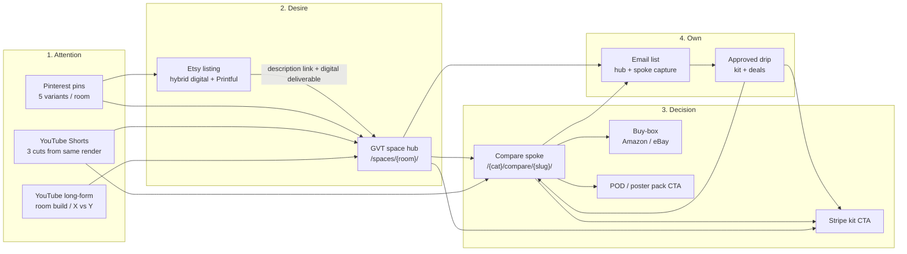

# Gear Versus Tech — MASTER PLAN

**Status:** Planning deliverable only (2026-07-16). No code claimed working. No secrets.  
**Target:** https://gearversustech.com  
**Repo (current):** `C:\Users\dalec\OneDrive\Websites\gearversustech`  
**Note:** Prefer clean clone under `C:\Users\dalec\repos\` for future builds (OneDrive can silently revert).  
**UKAirConTracker:** read-only — do not touch.  
**Estate brain:** listed; no build task claimed for this plan-only deliverable.  
**Distribution funnel:** canonical in §L; standalone extract `docs/GVT-AD-FUNNEL.md`.

---

## Locked decisions (do not reopen)

1. **One site.** Comparison service is the heart. No second domain.
2. **Affiliate = floor, not payroll.** Amazon is slow (24h cookie, delayed payout). Primary cash = Stripe kits + POD (Printful) + email.
3. **Scale via Supabase rows**, not Netlify deploys per article. Deploy only for template/engine/route changes.
4. **Design via estate `visual-experience`** (taste dials composed in; full 88KB taste skill quarantined). Commerce fixes before redesign-first; redesign templates once, then scale pages on them.
5. **No unreviewed AI firehose.** Parallel generation OK; human/Telegram gate before publish (Helpful Content / scaled-content abuse risk).
6. **Layers:** room/space hubs = traffic · X vs Y = money · kits/POD = margin.
7. **Digital products = decisions/kits/verified UK lists + planners** — not generic info PDFs AI can replace.
8. **POD:** personalised + gallery packs of 3; hybrid digital printable + Printful physical; original IP only (no licensed game art).
9. **UK Amazon rates:** electronics/PC lower; Home/Furniture/Sports better — verify in Associates Central. Earlier “7%” claim may be outdated.
10. **Known bugs:** empty winner card when ASIN missing/sync miss (Wooting — ASINs exist on Amazon UK); `sitemap-articles.xml` hardcodes `/smart-home/compare/` for all slugs.

---

## A. Vision & positioning

Gear Versus Tech is the UK decision engine for building real rooms — gaming setups, man caves, garage gyms, pub sheds, renter-safe smart home — not another gadget blog. Every page exists to answer “what should I buy, at which budget, for my UK constraints?” with head-to-head evidence, live buy boxes, and optional paid kits that hand the visitor a finished cart. Traffic comes from space hubs and comparison intent; money comes from Stripe decisions and POD wall packs; Amazon/eBay affiliate is the free upside on the same URLs.

---

## B. Business model stack

| Layer | What | When money hits | Role |
|---|---|---|---|
| **Stripe kits / planners** | Budget-band room builds, verified UK shopping lists, interactive planners | Instant / few days | **Primary cash** |
| **Printful POD (+ optional Etsy)** | Personalised name art + packs of 3; digital printable + physical | Days (POD fulfilment lag) | **Margin / brand** |
| **Email list** | Capture on hubs + money pages → kit offer + deals | Days after capture | **Highest CVR channel** (industry ~3–8% affiliate CVR by email vs cold social — treat range as directional) |
| **Amazon Associates** (`gearversustech-21`) | Buy boxes on every compare/hub | Cookie **24h**; payout lag 30–60d+ | **Floor / free upside** |
| **eBay EPN** (`campid` already wired) | Alt CTA on products | Similar lag | Secondary affiliate |
| **Lead-gen (later)** | Installer / EV / garden-room quotes | Per-lead, weeks | Phase 2 only — after kits + email work |

**Evidence anchors (light):**
- Live pattern: Garage Gym Build Kit ~$29 on Stripe (budget builds + planner + links) — people pay for *decided carts*, not essays.
- Amazon UK short cookie is structural delay, not a GVT bug.
- UK rate card (verify in Associates Central): Furniture/Home/Home Improvement ≈ **5%**; Sports & Fitness ≈ **4%**; PC-ish electronics ≈ **2.5%** — gym/home baskets beat gaming electronics on rate. **Assumption:** rates change; never hardcode “7%”.

**Implication:** Ship at least one Stripe SKU before obsessing over Amazon rank. Affiliate scales with pages; payroll does not wait on Amazon.

---

## C. Content architecture

### Model: hub → spoke → buy-box

```
Space hub (traffic / Pinterest / AEO)
  └─ Budget tiers + “get the kit” CTA
       └─ X vs Y / Best under £X (money)
            └─ Winner card + Amazon/eBay + kit upsell
```

| Layer | Job | Examples |
|---|---|---|
| **Hub** | Capture intent + email + kit | `/spaces/gaming-room/`, `/spaces/garage-gym/` |
| **Spoke** | Decision + affiliate | `/gaming/compare/wooting-…/`, `/home-gym/compare/…` |
| **Buy-box** | Conversion UI | Winner/runner-up cards from `gvt_affiliate_links` |
| **Product CTA** | Margin | Stripe kit / POD pack on hub + foot of spoke |

### Categories (priority)

| Priority | Category slug (proposed) | Why first |
|---|---|---|
| **P0** | Existing: `gaming`, `smart-home`, `best` | Already live; fix engine here |
| **P1** | `home-gym` (UK garage / small room) | Higher Amazon rates + kit AOV; clear UK constraints (2.4m ceiling, terrace noise) |
| **P2** | Space hubs: gaming-room, man-cave, pub-shed, garage-gym | Traffic layer; feeds spokes |
| **P3** | Renter-safe smart home expansion | Deposit/no-drill angle |
| Later | Garden office / hybrid | After P1–P2 templates exist |

**Assumption:** new category needs a route folder (or one dynamic `[category]/compare/[slug]`). That is a **deploy** change; articles after that are DB-only.

### 50-title seed → priority batches

Condensed from prior research. Publish only via Telegram/human gate.

**Batch 0 — Engine proof (fix money leaks first)**  
Existing live compares with broken/empty buy boxes (Wooting etc.). No new titles until ASIN sync + winner card fail-soft ships.

**Batch 1 — Gaming money spokes (ship 8)**  
1. Wooting 60HE vs Razer Huntsman V3 Pro  
2. Best 60% keyboard under £150 UK  
3. Keychron vs Logitech for work+game  
4. Best budget gaming mouse 2026 UK  
5. Headset for flats (noise / neighbours)  
6. Monitor arm for IKEA desk UK  
7. Desk under 120cm UK  
8. ISO-UK keyboard buying guide (spoke + hub feed)

**Batch 2 — Home gym UK (ship 10 — first new category)**  
9. Garage gym under 2.4m ceiling  
10. Mirafit vs Rogue UK  
11. Best rack for single garage  
12. Home gym under £500  
13. Home gym under £1,000  
14. Home gym under £2,500  
15. Rubber flooring noise for terraces  
16. Adjustable dumbbells UK head-to-head  
17. Wall-mount vs free-standing rack  
18. Neighbour-friendly cardio picks  

**Batch 3 — Space hubs (4 hubs, thin but real)**  
19. Gaming room hub (tiers £500 / £1.5k / £5k)  
20. Man cave hub  
21. Garage gym hub  
22. Pub shed hub  

**Batch 4 — Smart home / renter (6)**  
23. Renter-safe starter kit  
24. Echo vs Home Assistant for beginners  
25. Best smart bulb under £15  
26. Doorbell for flats  
27. Matter vs Zigbee 2026  
28. “No hub” smart plug stack  

**Batch 5 — Remaining seed (hold until Batch 1–3 convert)**  
Small-bedroom battlestation under £800; cable management kit list; RGB vs no-RGB; stream overlay starter; laptop + monitor; “don’t buy” chair mistakes; Scan vs Amazon stock; thermostat that saves £; energy monitor under £50; cinema-room lighting; treadmill vs rower small rooms; used vs new plates; ceiling pull-up alternatives; garden-room gym; bench width 2.5m; smith machine traps; UK stock checklist; projector vs TV; acoustic panel kit; mini-fridge + desk power; LED layouts; sofa+setup layouts; him-shed planning basics; gaming+gym combo; garden office/gym hybrid; before/after 3 tiers; EV charger quote vs DIY — **~22 titles in reserve**.

**Cadence rule:** generate in parallel; publish ≤ few/week with gate. Quality > volume. Target after engine fix: **~20–30 published new pages in 90 days**, not 200 AI dumps.

---

## D. Product catalog (first SKUs)

### Stripe digital (decisions, not essays)

| SKU | Section | Price band | Contents |
|---|---|---|---|
| **Gaming Room Build Kit** | Gaming / space hub | £19–£29 | 3 budget tiers, UK Amazon/eBay list (CSV/Notion), layout notes, cable plan |
| **Garage Gym Build Kit (UK)** | Home gym | £19–£29 | Ceiling/space constraints, rack/flooring picks, noise notes, cart list — mirrors proven $29 kit pattern |
| **Man Cave / Pub Shed Kit** | Spaces | £15–£25 | Bar/soft furnishing tiers + lighting + power |
| **Renter Smart Home Starter** | Smart home | £12–£19 | No-drill stack, verified UK ASINs, uninstall plan |
| **Interactive planner (v2)** | Any hub | £9–£19 add-on or bundle | Quiz → filtered kit (not a PDF dump) |

**Rule:** every SKU must include *one decided cart* + UK availability reality. No “Ultimate Guide” filler.

### POD / Printful (original IP)

| SKU | Format | Price band (retail) |
|---|---|---|
| **“X’s Game Room” personalised** | Printful poster + digital printable | £18–£35 physical / £8–£12 digital |
| **Gaming blueprint pack of 3** | Gallery set | £15–£28 |
| **Garage gym typography / layout pack of 3** | Gallery set | £15–£28 |
| **Man cave patent-style (original) pack of 3** | Gallery set | £15–£28 |
| **Pub shed sign pack** | Personalised + set | £18–£32 |

**Hard no:** licensed game art, celebrity likeness, team logos. Hybrid: sell digital printable immediately; offer Printful physical as upgrade.

**Assumption:** Etsy is optional distribution; site Stripe + Printful can ship first without Etsy if Dale prefers fewer accounts.

---

## E. Technical publish pipeline

### Current stack (verified in repo)

- Astro `output: 'server'` + `@astrojs/netlify`; pages `prerender = false`
- Content: Supabase `gvt_articles` + `gvt_affiliate_links` (+ `gvt_clicks`)
- Amazon sync: `scripts/sync-amazon-products.mjs` (Creators API; PARTNER_TAG `gearversustech-21`)
- Deploy guard in `netlify.toml`: ignore unless `$INCOMING_HOOK_TITLE` set (batched deploys / credit control)
- Build-time sitemap: `scripts/generate-sitemap.ts` uses `category` correctly
- Runtime sitemap bug: `src/pages/sitemap-articles.xml.ts` hardcodes `/smart-home/compare/` — **fix**

### CMS model

| Action | Where | Redeploy? |
|---|---|---|
| New/updated article (`published=true`) | Supabase row | **No** (SSR reads live) |
| Price/ASIN/image refresh | `gvt_affiliate_links` via sync script | **No** |
| Draft / unpublish | `published=false` | **No** |
| New category route / hub template / schema change | Code | **Yes** (build hook only) |
| Design system / layout / buy-box UI | Code | **Yes** |
| Stripe/POD product pages | Code + Stripe dashboard | **Yes** for routes |

### SEO / AEO / GEO (without redeploy per article)

- SSR already serves fresh HTML from DB — good for crawlers and answer engines.
- Article + Product schema already on compare templates — keep; extend FAQ/HowTo only where content warrants.
- Fix dynamic sitemap; submit `sitemap-articles.xml` + main sitemap in GSC.
- **IndexNow** (Bing/Yandex etc.): ping on publish (DB webhook or gated script) — no Netlify deploy.
- **GSC:** monitor coverage; don’t spam crawl requests.
- Canonical URLs must use real `category` (already correct on page routes; broken on runtime sitemap).

### What triggers a Netlify deploy

**Deploy (build hook):** template, route, adapter, layout, buy-box component, new hub page type, dependency bumps, sitemap *route* logic fixes.  
**Do not deploy for:** article text, prices, images, publish flags.  
**Kill switch:** existing ignore + estate `netlify-deploy-STOP.flag` / Telegram-approved release path — never auto-deploy from git push alone.

---

## F. Design system track

Use estate **`visual-experience`** (canonical). Taste skill: dials only; full 88KB quarantined.

### Draft dials (GVT public surfaces)

| Dial | Draft | Rationale |
|---|---|---|
| `DESIGN_VARIANCE` | **7** | Room/gear brand needs distinct look; not SaaS purple |
| `MOTION_INTENSITY` | **4** | GSAP scroll reveals OK; no spectacle competing with buy boxes |
| `VISUAL_DENSITY` | **6** | Spec tables + verdicts need density; hubs can breathe more |

### Templates to lock (once, then scale)

1. **Home** — brand-first hero, 4 space entry points, latest money pages  
2. **Hub (space)** — tiers + kit CTA + spoke grid + email  
3. **Compare** — winner/runner-up buy boxes (never empty-looking), Big 5 body, kit upsell, email  
4. **Product CTA block** — Stripe + POD, reusable on hub/compare  

### Motion rules

- Keep existing GSAP fade/slide for cards/sections; respect `prefers-reduced-motion`.
- **`three` is in `package.json` but unused in `src/` — dead weight.** Do not load Three.js on comparison pages. WebGL only if a future planner genuinely needs spatial inspection.
- No motion that delays LCP of winner image/CTA.

### Sequencing

Commerce + buy-box integrity **before** full redesign. Then one redesign pass on the four templates → freeze → scale content on frozen shells.

---

## G. Automation

### Safe (build / schedule OK)

| Automation | Notes |
|---|---|
| Amazon price/ASIN/image sync | Existing script; report-then `--write`; confidence checks already in code |
| Affiliate link QA | `scripts/qa-affiliate-links.mjs` |
| Sitemap regenerate ping / IndexNow on publish | After human publish |
| Pin / social **asset** gen (local GPU) | Draft only; publish needs Telegram approval |
| Click tracking | Already fire-and-forget to `gvt_clicks` |
| Email drip drafts | Prepare sequences; send still approval-gated |

### Unsafe / banned

| Automation | Why |
|---|---|
| Auto-publish articles hourly from LLM | Scaled content abuse / HCU risk |
| Auto-post Reddit / X / forums with links | Anti-ban + platform spam; estate policy |
| Identity/proxy rotation, CAPTCHA bypass | Hard prohibited |
| Unsolicited bulk messaging | Hard prohibited |
| Deploy on every content change | Netlify credit burn |

**Gate:** `published` flips only after Dale/Telegram review. Parallel draft generation in a `draft` table or `published=false` is fine.

---

## H. Parallel workstreams

Not a fake waterfall. Run concurrently; sync only at real bottlenecks.

| Stream | Owns | Can ship without waiting on |
|---|---|---|
| **Money** | Stripe SKUs, checkout links, kit copy | Full redesign; 50 articles |
| **Pages** | Hub + spoke content (DB), Batch 1–3 titles | Design polish (use frozen wire if needed) |
| **Capture** | EmailCapture wired to real ESP; CTAs on every money page | POD catalogue |
| **Engine** | Winner-card fail-soft; ASIN sync; sitemap category fix; category field for `home-gym` | Marketing |
| **Design** | visual-experience pass on 4 templates | Mass page count |
| **POD** | Printful account → 2–3 packs + 1 personalised | SEO rankings |

### Real sync points only

1. **Engine buy-box + sitemap fix** before mass-publishing Batch 1+ (otherwise you scale broken money pages).  
2. **One locked compare + hub template** before mass hub generation (otherwise rebuild tax).  
3. **Stripe checkout live** before pushing hard traffic to kit CTAs.  
4. **Publish gate** always — no bypass for “just this batch.”  
5. **Deploy** only when Engine/Design code lands — batch those into one build-hook fire.

---

## I. 30 / 60 / 90 day outcomes (measurable)

**Assumptions:** traffic starts low (~23 live pages historically); outcomes are operating metrics, not fantasy revenue.

### Day 30 — Engine + first cash

- [ ] Winner card never renders “empty shell” when ASIN missing (fail-soft: search CTA / manual ASIN / hide price, never blank)
- [ ] Wooting (and similar) resolved in `gvt_affiliate_links` with verified UK ASINs
- [ ] Runtime sitemap uses `/{category}/compare/{slug}/`
- [ ] 1 Stripe kit live (Gaming Room or Garage Gym)
- [ ] Email capture writes to real list (not placeholder)
- [ ] Batch 1: ≥5 gaming spokes published (gated)
- [ ] Zero unapproved Netlify prod deploys; ≤1–2 build-hook deploys for engine/template

### Day 60 — Surface area + margin

- [ ] `home-gym` category live (route + ≥6 published spokes)
- [ ] 4 space hubs live with kit CTAs
- [ ] 2nd Stripe kit live
- [ ] 1 personalised POD + 1 pack-of-3 live (site and/or Etsy)
- [ ] IndexNow + GSC sitemaps clean; no smart-home-only sitemap pollution
- [ ] Email → kit sequence (3 emails) drafted and first send approved
- [ ] Design templates locked (dials applied once)

### Day 90 — Compounding

- [ ] ~40–50 published money/hub URLs total (quality-gated)
- [ ] Kit sales ≥1 (proof of offer, even if small)
- [ ] Affiliate clicks tracked; top 10 pages by click identified
- [ ] Amazon category rate check logged from Associates Central (no stale “7%”)
- [ ] Lead-gen decision: go / no-go (default no-go unless kits convert)

---

## J. Risks & kill switches

| Risk | Symptom | Kill switch / response |
|---|---|---|
| **Google scaled content** | Coverage drop, “spam” / HCU demotion | Freeze publish; audit thin pages; no hourly LLM; tighten gate |
| **Amazon rate cuts / cookie** | EPC collapse | Shift CTA gravity to Stripe/POD; verify rates quarterly |
| **Blank buy boxes** | Winner without image/price/ASIN | Engine fail-soft; block `published=true` if winner has no link_key row (optional hard gate) |
| **Netlify credit burn** | Deploy spam | Keep ignore-unless-hook; never deploy for DB content; STOP flag |
| **ASIN mismatch / lookalikes** | Sync confidence fail (Secretlab/Wooting/Homey DTC rules already in script) | Manual ASIN override field (**assumption:** add if missing) |
| **POD IP strike** | Etsy/Printful takedown | Original IP only; no game art |
| **OneDrive revert** | Mystery file undo | Move active work to `repos\` worktree |
| **UKAirConTracker bleed** | Accidental edits | Never open that asset for GVT work |

---

## L. Advertising / Distribution Funnel

**Canonical location for the distribution funnel.** Standalone extract: `docs/GVT-AD-FUNNEL.md`.  
**Scope:** YouTube · Pinterest · Etsy · GVT site. No code, no deploys, no secrets.  
**Approval channel:** HermesFusion_bot / Telegram. Estate anti-ban mode on.

### L1. Funnel thesis

GVT does not win by “posting more gear content.” It wins by turning one room decision into a **owned path**: YouTube and Pinterest create *room desire* and park people on **space hubs**; spokes close the *which product* decision with buy boxes; Etsy harvests the people who already want the wall art / printable of that room; email turns every visitor into a second chance at a **Stripe kit** (primary cash) while Amazon/eBay remain free floor. Distribution is a fan-out of the same render + Remotion cut + DB hub update — never a Netlify deploy per post, never auto-publish, never fake engagement.

### L2. Funnel map (Attention → Desire → Decision → Own)



**ASCII (if Mermaid not available):**

```
ATTENTION                    DESIRE                 DECISION                    OWN
─────────                    ──────                 ────────                    ───
YT long ──┐
YT Shorts ┼──► /spaces/{room}/ ──► /{cat}/compare/{slug}/ ──► Amazon/eBay
Pins ─────┘         │                    │                    Stripe kit
                    │                    └──► POD pack CTA     Email ──► drip ──► kit
                    └──► email capture
Etsy hybrid listing ──► digital download + link to same hub (not cold spam)
```

**Job of each surface (one line):**

| Surface | Stage | Job |
|---|---|---|
| YouTube long | Attention → Desire | Prove the room; send to hub |
| YouTube Shorts | Attention | Hook + one CTA to hub or one money spoke |
| Pinterest | Attention → Desire | Evergreen room porn → hub (primary) / Etsy (secondary) |
| Etsy | Desire → Own product | Sell POD/digital; soft-route browsers to GVT hub |
| GVT hub | Desire | Tiers + kit + email + spoke grid |
| GVT spoke | Decision | Winner + affiliate + kit/POD upsell |
| Email | Own | Highest-intent re-hit on kit + deals |

### L3. Per-channel playbooks

#### YouTube

**Job in funnel:** Attention engine + trust. Long-form builds the room story; Shorts multiply the same footage. Primary destination = **space hub**. Secondary = one **money spoke** when the video is pure X vs Y.

**Organic formats + cadence**

| Format | Length | Cadence (start) | Source |
|---|---|---|---|
| Long-form room build / budget tiers | 8–14 min | 1 / week | Remotion + ComfyUI stills + B-roll |
| Long-form X vs Y (gaming/gym) | 6–10 min | 1 / fortnight (alt with room) | Same pipeline; product close-ups |
| Shorts | 20–45s | 3 / long-form (same week) | Cuts from long; one hook each |
| Community / pinned comment | — | On every upload | Hub URL + kit mention (no spam replies) |

**Assumption:** Channel can start at 1 long/week; do not scale Shorts volume until hooks are proven (watch % + CTR to site).

**CTAs and landing destinations**

| Video type | Primary CTA | Destination URL type |
|---|---|---|
| Room build (gaming / man cave / garage gym / pub shed) | “Full UK build tiers” | `/spaces/{room}/` |
| Budget tier deep-dive | “Get the kit” | Hub anchor `#kit` or Stripe product page (when live) |
| X vs Y | “Full comparison + UK prices” | `/{category}/compare/{slug}/` |
| Shorts | One line + end screen | Hub preferred; spoke only if title is product-specific |

**Never:** link only to Amazon in description (cookie dies; you train Amazon, not GVT). Affiliate lives on the spoke after they land.

**Listing / SEO title patterns**

```
{Room} on a UK Budget: £{low} vs £{mid} vs £{high} (2026)
{Product A} vs {Product B} UK — Which Should You Buy?
Garage Gym Under 2.4m Ceiling UK — Full Layout
{Room} Setup Ideas UK — Cable Plan + Desk Under 120cm
```

Description skeleton (no secrets):

1. One-sentence promise  
2. Timestamp chapters  
3. **GVT hub/spoke link** (UTM’d)  
4. Kit CTA if SKU live  
5. “UK prices / availability — check the page” (honesty > hype)  
6. Affiliate disclosure if any Amazon mention on-video  

Tags: room intent first (`garage gym uk`, `gaming room setup uk`), product second.

**Paid ads: when yes / when no**

| Yes (later) | No (now / never as default) |
|---|---|
| After 3+ videos with proven CTR to hub + kit live | Boosting unproven Shorts |
| Retarget site visitors / email engagers (small UK geo) | Broad “gaming setup” prospecting with no offer |
| Promote one kit landing once Stripe converts organically | Always-on YouTube ads before email + kit exist |

**Metrics that matter**

- End-screen / description CTR → GVT (not vanity views)  
- Hub sessions from `utm_source=youtube`  
- Email captures from YT-attributed sessions  
- Kit purchases attributed to YT (last non-direct + assisted)  
- Shorts: 3s hold + swipe-away; kill formats that don’t earn hub clicks  
- Ignore: subscriber count as a success metric in month 1

#### Pinterest

**Job in funnel:** Evergreen Attention → Desire. Pins are the cheapest long-tail room traffic for hubs. Secondary job: push gallery/POD intent toward Etsy **or** GVT POD CTA (one primary per pin set — don’t split every pin).

**Organic formats + cadence**

| Format | Spec (practical) | Cadence |
|---|---|---|
| Vertical idea pin (room hero) | 2:3, text overlay: room + UK budget | 5 pins / room render (fan-out) |
| Carousel / multi-image | Tier A / B / C stills | 1 per hub launch |
| Comparison pin | “A vs B — winner on GVT” | When spoke publishes |
| Seasonal refresh | Same asset, new title | Quarterly, not daily spam |

**Cadence start:** 5–10 pins/week across 1–2 rooms max. Quality boards > spray.  
**Assumption:** Business account; Idea Pins optional — static 2:3 stills from ComfyUI are enough to start.

**CTAs and landing destinations**

| Pin intent | Destination |
|---|---|
| Room inspiration / tiers | `/spaces/{room}/` (**default**) |
| Product decision | `/{category}/compare/{slug}/` |
| Wall art / printable | Etsy hybrid listing **or** GVT POD product URL — pick one primary per campaign |
| Kit | Hub `#kit` / Stripe URL only when SKU live |

**Listing / SEO title patterns**

```
UK {Room} Ideas — {Budget} Setup Layout
{Room} Moodboard: Desk, Lighting, Cable Plan (UK)
Garage Gym Layout for Small UK Garages
Man Cave Bar Shed — Lighting + Power Checklist
{Product A} vs {Product B} — UK Buy Guide
```

Pin description: 2–3 sentences, keywords natural, single URL, disclosure if affiliate page.

Board taxonomy (keep lean):

- Gaming Room UK  
- Garage Gym UK  
- Man Cave / Pub Shed  
- UK Gear Comparisons  
- Printable Room Art (POD)

**Paid ads: when yes / when no**

| Yes | No |
|---|---|
| After organic pin → hub CTR proven; kit or POD live | Cold traffic ads to empty kit CTAs |
| Small UK/IE geo tests on best-performing pin creative | Broad interest blasting daily |
| Retarget GVT visitors | Buying traffic to Amazon outbound |

**Metrics that matter**

- Outbound clicks → GVT (and Etsy if used)  
- Saves (quality signal for distribution)  
- Hub / spoke sessions `utm_source=pinterest`  
- Email + kit from Pinterest sessions  
- Cost per email / cost per kit **only after** paid starts  
- Ignore: impressions without outbound clicks

#### Etsy

**Job in funnel:** Desire → Own **product** (POD + digital). Not a traffic replacement for SEO. Etsy buyers who want the poster of the room they saw on Pinterest/YT; listing copy routes browsers to the matching **GVT hub** for the full build (soft, policy-safe — no bait-and-switch).

**Organic formats + cadence**

| Listing type | Contents | Cadence |
|---|---|---|
| Hybrid digital + physical | Printable download + Printful physical upgrade | 1 listing per room pack to start |
| Personalised (“X’s Game Room”) | Name field + mockups | 1–2 variants after first pack sells |
| Pack of 3 gallery | Same visual system as GVT POD | Launch with hub, not before IP is clean |

**Cadence:** 1 solid listing / fortnight until 4 room packs exist. Photos > volume.  
**Hard no:** licensed game art, team logos, celebrity likeness (locked decisions).

**CTAs and landing destinations**

| Surface | CTA |
|---|---|
| Listing photos | Mockup on real wall + “digital instant / physical ships” |
| Description | “Building the full room? UK tiers + shopping list →” **hub URL** (UTM’d) |
| Digital thank-you / download PDF cover | Same hub + kit offer |
| GVT site | Reciprocal: POD block can mention “also on Etsy” (**assumption:** only if brand wants marketplace SEO; not required) |

Do **not** stuff Etsy with affiliate link farms. One hub link in description is enough.

**Listing / SEO title patterns** (Etsy ~140 char; front-load)

```
Gaming Room Poster Printable | UK Setup Blueprint Wall Art | Digital Download
Garage Gym Wall Art Set of 3 | Home Gym Printable Posters | Instant Download
Personalised Game Room Print | Custom Name Gaming Poster | Digital + Print
Man Cave Bar Shed Sign Printable | Pub Shed Wall Art UK
```

Tags: room + printable + poster + digital download + UK spelling variants sparingly.  
Attributes: digital download + physical when hybrid.

**Paid ads: when yes / when no**

| Yes | No |
|---|---|
| Etsy Ads **after** organic listing has views + ≥1 sale or strong favorites | Day-1 max bid on untested creative |
| Offsite ads only with proven SKU + margin math | Running Etsy Ads to “build brand” with no GVT email capture plan |

**Metrics that matter**

- Listing views → favorites → orders  
- Digital vs physical mix (margin)  
- Refund / IP strike zero  
- Visits to GVT from Etsy UTMs (secondary)  
- Net profit after Printful + Etsy fees (not gross sales)

### L4. Single-asset fan-out recipe

**One room render (ComfyUI/RTX) → full weekly packet.** No Netlify deploy. Hub copy update = Supabase (or CMS row) only.

**Inputs (once)**

1. **Hero room still** (master) + 2 angle variants + 1 detail crop  
2. **Budget tier labels** (£low / £mid / £high) burned or overlaid in Remotion  
3. **Spoke targets** — 1–2 live compare URLs for products visible in the room  
4. **Kit SKU status** — live or omit kit CTA  
5. **Etsy/POD pack** — same art, print-safe export (300dpi / Printful template)

**Outputs (same week)**

| # | Asset | Notes |
|---|---|---|
| 1 | **Long YouTube** | Remotion assembly: hook → 3 tiers → 2 product callouts → CTA to hub |
| 3 | **Shorts** | (1) hero reveal, (2) £budget shock, (3) one product “don’t buy X buy Y” |
| 5 | **Pins** | 3 room variants + 1 tier comparison graphic + 1 spoke “A vs B” |
| 1 | **Etsy hybrid listing** | Pack-of-3 or personalised using same IP; hub link in description |
| 1 | **GVT hub update** | New hero still, tier blurb, spoke links, email + kit CTAs — **DB only** |

**Production order (minimize thrash)**

```
ComfyUI master stills
  → print-safe crop (POD/Etsy)
  → Remotion long
  → export 3 Shorts
  → export 5 pin stills (overlays)
  → draft YT titles/descriptions + pin copy + Etsy listing (local drafts)
  → Telegram approve packet
  → publish YT → Pins → Etsy (stagger same day or +24h)
  → flip/update hub row in Supabase (no deploy)
  → IndexNow/GSC hygiene if new spoke URLs published same week (optional)
```

**Do not:** trigger Netlify build for the hub image/copy update.

### L5. UTM + conversion taxonomy

**UTM convention**

```
utm_source   = youtube | pinterest | etsy | email | direct
utm_medium   = video | social | referral | email | cpc
utm_campaign = {room}_{yyyymm}           e.g. gaming-room_202607
utm_content  = {asset_id}                e.g. long01 | short02 | pin03 | listing
utm_term     = optional keyword          e.g. under-1500 | wooting-vs-razer
```

**Examples**

```
https://gearversustech.com/spaces/gaming-room/?utm_source=youtube&utm_medium=video&utm_campaign=gaming-room_202607&utm_content=long01

https://gearversustech.com/gaming/compare/wooting-60he-vs-razer-huntsman-v3-pro/?utm_source=youtube&utm_medium=video&utm_campaign=gaming-room_202607&utm_content=short03

https://gearversustech.com/spaces/garage-gym/?utm_source=pinterest&utm_medium=social&utm_campaign=garage-gym_202607&utm_content=pin02

https://gearversustech.com/spaces/gaming-room/?utm_source=etsy&utm_medium=referral&utm_campaign=gaming-room_202607&utm_content=listing
```

**Assumption:** Hub paths `/spaces/*` are proposed IA (§C) — confirm before hardcoding in templates; until hubs exist, land on best live category hub/home with same UTM grammar.

**Conversion events (track / define)**

| Event | Definition | Primary owner |
|---|---|---|
| `session_hub` | Land on space hub | Desire |
| `session_spoke` | Land on compare | Decision |
| `click_affiliate` | Buy-box Amazon/eBay (`gvt_clicks` or equiv.) | Floor revenue |
| `email_capture` | ESP subscribe from hub/spoke | Own |
| `kit_checkout_start` | Stripe Checkout opened | Cash |
| `kit_purchase` | Stripe paid | Cash |
| `pod_purchase_site` | Printful/Stripe POD on GVT | Cash |
| `pod_purchase_etsy` | Etsy order (export/CSV later) | Cash |
| `assisted_kit` | Email drip → kit within 7d | Own |

**Reporting grain (weekly):** by `utm_source` × `utm_campaign` → sessions → email → kit → affiliate clicks.  
**Do not optimize for:** affiliate clicks alone (24h cookie; delayed payout).

**Disclosure:** UK-facing clear affiliate disclosure on spokes + any YT description that mentions products. Etsy: handmade/digital attributes truthful.

### L6. Approval / anti-ban gates

**Allowed without Telegram approval**

- Local ComfyUI / Remotion / pin image generation  
- Draft titles, descriptions, Etsy listing copy (unpublished)  
- Hub/spoke **draft** rows (`published=false`)  
- This plan and redacted metrics notes  
- Affiliate link QA / Amazon sync dry-runs (no secret dump in chat)

**Requires HermesFusion_bot / Telegram approval**

| Action | Why |
|---|---|
| YouTube publish (long or Shorts) | Social publish |
| Pinterest publish / scheduling live | Social publish |
| Etsy listing go-live or major update | Marketplace publish |
| Email campaign / drip send | Unsolicited risk if cold; always gated |
| Paid ads (YT / Pinterest / Etsy Ads) | Paid spend |
| Prod Netlify deploy | Credit + production |
| Credentials / API keys for platforms | Secrets |

**Hard prohibited (estate anti-ban)**

- Fake views, bots, purchased engagement, engagement pods  
- Auto-comment spam, mass DMs, unsolicited bulk email  
- CAPTCHA bypass, proxy/identity rotation to evade limits  
- Scraping/automation that violates platform ToS / robots  
- Cloaking different content to ads vs users  
- Licensed IP on POD/Etsy  
- Auto-deploy on content publish  
- Auto-publish LLM articles on a timer  

**Publish packet checklist (attach to every Telegram ask)**

1. Asset list (files + destinations)  
2. Final URLs with UTMs  
3. Disclosures present  
4. Hub/spoke live and buy-box not empty (for any spoke linked)  
5. Kit CTA only if Stripe live — else omit  
6. IP original confirmation for POD/Etsy  
7. No Netlify deploy requested unless code changed  

### L7. 30-day distribution sprint checklist

**Goal:** Prove the loop **render → YT/Pins → hub → email/kit (or affiliate floor)** on **one room**, not presence on every platform.

**Assumptions:** Engine buy-box + at least one money spoke healthy before heavy traffic; Stripe kit #1 ideally live by week 3; hubs may start as “best available landing” if `/spaces/*` not coded yet.

**Week 0 — Prep (days 1–3)**

- [ ] Pick **one** room for the sprint (recommend: **gaming-room** or **garage-gym** — kit narrative clearest)  
- [ ] Confirm landing URL (hub if live, else temporary spoke cluster / home section)  
- [ ] Confirm 2 spoke URLs with non-empty buy boxes  
- [ ] UTM spreadsheet tab: campaign name `{room}_{yyyymm}`  
- [ ] ESP capture working on landing (or explicitly defer email metrics)  
- [ ] Printful template + Etsy draft listing ready (unpublished)  
- [ ] Remotion + ComfyUI pipeline smoke: one still → 15s test cut  

**Week 1 — First packet**

- [ ] Produce master stills (hero + 2 angles + detail)  
- [ ] Remotion long #1 drafted  
- [ ] 3 Shorts cut  
- [ ] 5 pins exported  
- [ ] Hub row/content updated in DB (draft → ready)  
- [ ] Telegram approve → publish YT long + 3 Shorts + 5 pins (stagger OK)  
- [ ] Etsy listing: approve → publish **or** hold if IP/mockups weak  
- [ ] Verify UTMs hit Analytics/plausible/whatever is wired (no secrets in docs)  

**Week 2 — Double down / kill losers**

- [ ] Read metrics: YT CTR to site, pin outbound, hub bounce, email  
- [ ] Kill Shorts hooks with no site clicks; remix 2 new Shorts from same long  
- [ ] Refresh 3 pin titles (same creative) for best saver  
- [ ] Publish **one** X vs Y long **or** second room only if week 1 CTR > noise floor  
- [ ] Spoke footnote: “As seen on YouTube” optional — content only, no deploy  

**Week 3 — Cash layer**

- [ ] Stripe kit CTA live on hub (if not earlier)  
- [ ] YT pinned comment + description updated to kit (approval)  
- [ ] Email welcome / kit offer **drafted**; first send only after Telegram approve  
- [ ] Etsy: first A/B mockup swap if zero favorites  
- [ ] Log affiliate clicks from campaign UTMs (floor check, not KPI north star)  

**Week 4 — Retro + freeze**

- [ ] One-page retro: what earned hub sessions / email / kit  
- [ ] Freeze underperforming channel for next 30d (don’t “be everywhere”)  
- [ ] Lock fan-out recipe as SOP for room #2  
- [ ] Queue next room packet drafts only — **no** auto-schedule firehose  
- [ ] Confirm **zero** content-triggered Netlify deploys this month  
- [ ] Confirm **zero** unapproved social/marketplace publishes  

**Done = (distribution):** Not “posted daily.” Done means: **≥1 full fan-out packet shipped under approval**, UTMs readable, landing buy-box/kit honest, and a written keep/kill on YT vs Pins vs Etsy for the next sprint.

**Distribution assumptions** (see also Appendix — assumptions log): `/spaces/{room}/` until live → best equivalent landing; analytics stack TBD; Etsy optional vs Stripe POD; YT monetization irrelevant month 1; Pinterest lag weeks–months; Remotion local; default **no paid ads** first 30 days; no content-triggered Netlify deploys.

---

## M. Immediate first sprint — top actions

1. **Fix empty winner card** — fail-soft UI + root-cause ASIN sync for known misses (Wooting UK ASINs exist).  
2. **Fix `sitemap-articles.xml.ts`** — use `category` like `generate-sitemap.ts` already does.  
3. **Run Amazon sync with write** on all winners/runner-ups; QA with `qa-affiliate-links.mjs`.  
4. **Wire EmailCapture** to real ESP (ConvertKit/Buttondown/etc. — pick one); thank-you already exists.  
5. **Ship Stripe SKU #1** — Gaming Room or UK Garage Gym kit (£19–£29).  
6. **Publish Batch 1** (5–8 gaming spokes) behind Telegram gate — only after #1–3.  
7. **Add `home-gym` route** (or generic `[category]`) + seed 3 gym compares — one deploy.  
8. **Draft visual-experience brief** for compare + hub; lock dials; strip unused `three` on next design deploy.  
9. **Stand up Printful** — one personalised + one pack-of-3 (gaming or gym).  
10. **GSC + IndexNow hygiene** — submit corrected sitemap; document publish→ping checklist (no secrets in docs).  
11. **Pick one room + landing URLs for distribution** — gaming-room or garage-gym; confirm 2 healthy spokes + hub/fallback URL (§L7 Week 0).  
12. **Draft first fan-out packet** — ComfyUI stills → Remotion long + 3 Shorts + 5 pins + Etsy draft per §L4; Telegram approve before any publish.  
13. **Stand up UTM + weekly source report** — `{room}_{yyyymm}` campaign tab; measure hub sessions / email / kit by `utm_source` (§L5) — do not duplicate the full §L7 checklist here.

---

## Appendix — estate notes

- **Brain (snapshot):** estate unification audit `waiting_approval`; Wave 0 Knowledge Brain `complete`. No GVT build item claimed for this plan.  
- **Approvals required for:** prod deploy, social/Etsy publish, paid spend, shared DB schema changes, credentials.  
- **Allowed without approval:** local drafts, this plan, isolated branch code later, evidence-backed recommendations.  
- **Anti-ban mode:** on. No evasion, fake engagement, or unsolicited bulk.

---

## Appendix — assumptions log

1. ~23 live URLs at planning time — re-count before Day 30 report.  
2. UK Amazon % rates cited from prior research snapshot — **re-verify in Associates Central** before financial modelling.  
3. Email 3–8% CVR is industry directional, not a GVT guarantee.  
4. Garage Gym $29 competitor proves willingness to pay for kits; GVT UK pricing may differ.  
5. `home-gym` slug and `/spaces/*` hubs are proposed IA — confirm before coding routes.  
6. Manual ASIN override column may not exist yet — Engine stream should confirm schema without putting secrets in chat.  
7. Preferred future git root: `C:\Users\dalec\repos\` — migrate when starting implementation.

---

*End of master plan. Implementation starts only on explicit build command.*
